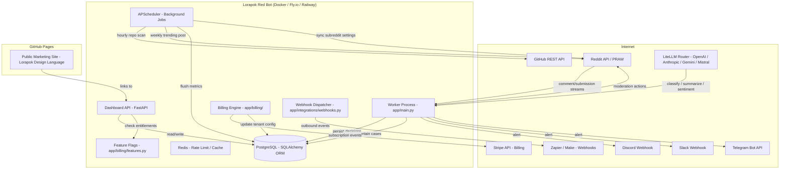
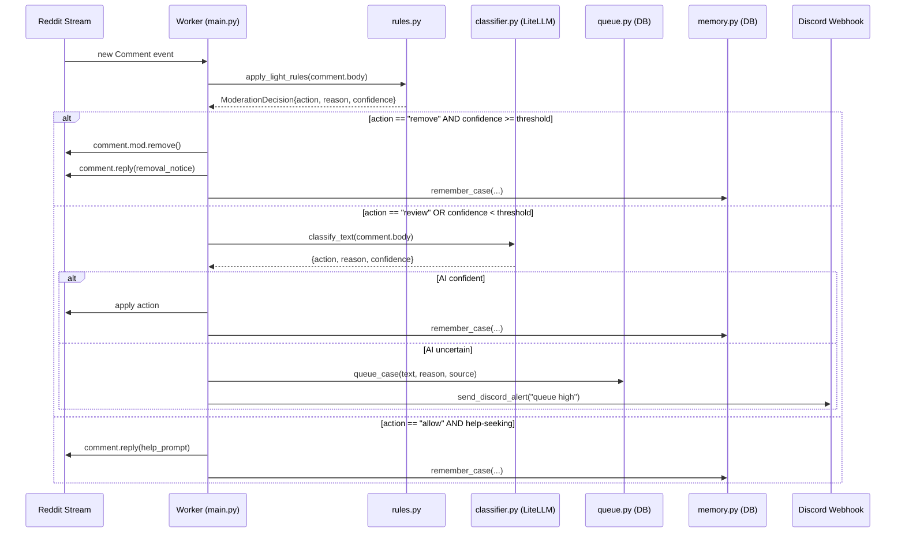
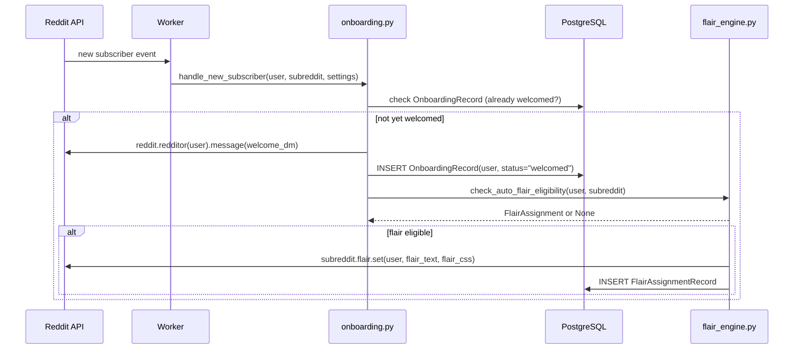
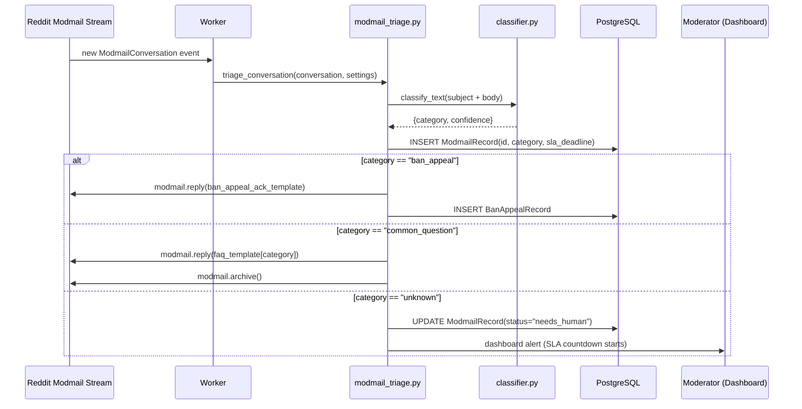
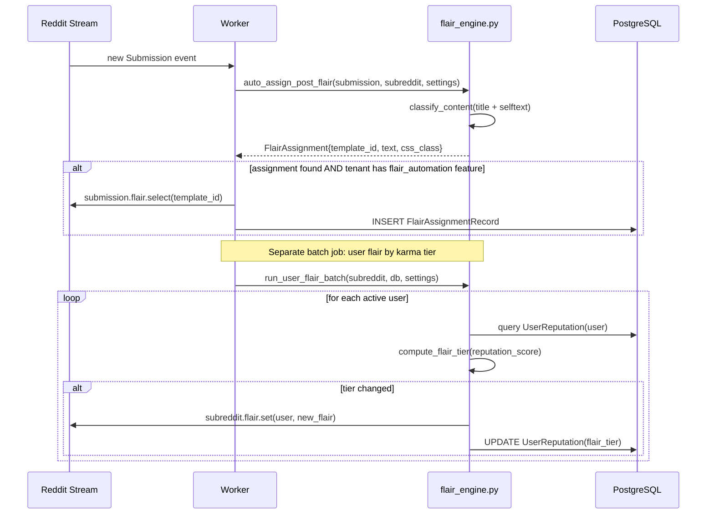
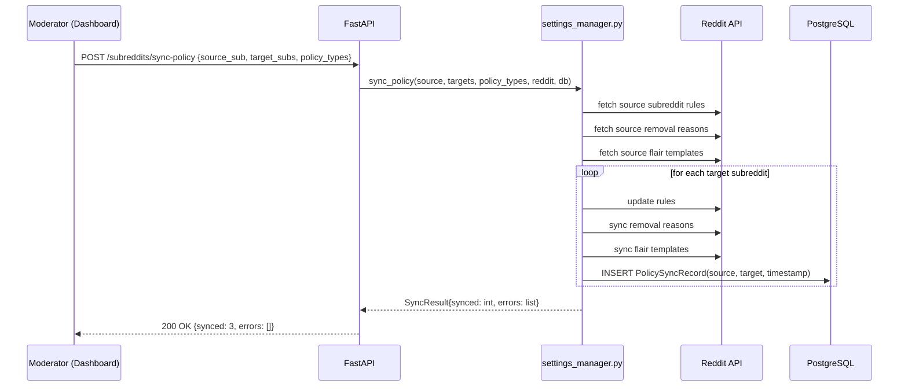

# Design Document: Lorapok Red Bot

## Overview

Lorapok Red Bot is a full-spectrum, 24/7 autonomous Reddit management platform for the Lorapok
open-source ecosystem and, as a commercial SaaS product, for any Reddit community operator.
It combines every controllable Reddit API surface — moderation, user management, flair, wiki,
modmail, widgets, rules, collections, live threads, multireddits, polls, emoji, and streams —
with an AI intelligence layer (classification, sentiment analysis, engagement prediction,
cross-subreddit spam detection), a multi-tenant billing engine, and a real-time analytics
dashboard wrapped in the Lorapok Design Language (biological UI, glassmorphism, animated dark
theme with glowing accents).

The system is deployed for free on Railway/Render/Fly.io (bot worker + FastAPI dashboard) and
GitHub Pages (public marketing site). Commercially it operates as a tiered SaaS product with
Free, Starter ($19/mo), Pro ($49/mo), Agency ($149/mo), and Enterprise (custom) plans, each
gated by a feature-flag and tenant-isolation layer backed by Stripe subscriptions.

The existing Python bootstrap under `app/` is functionally correct but architecturally flat.
This design replaces that with a layered, multi-tenant architecture — a thin infrastructure
shell around a pure domain core — while preserving every working algorithm and data model
already in place and adding the full Reddit API automation surface described below.

---

## Architecture

### System Context



### Internal Module Layers

```mermaid
graph LR
    subgraph Entrypoints
        E1[app/main.py - Worker]
        E2[app/dashboard/api.py - FastAPI]
        E3[app/billing/webhook_handler.py - Stripe]
    end

    subgraph Domain
        D1[moderation/rules.py]
        D2[moderation/classifier.py]
        D3[moderation/queue.py]
        D4[moderation/memory.py]
        D5[moderation/sentiment.py]
        D6[moderation/spam_detector.py]
        D7[posting/trending.py]
        D8[posting/scheduler.py]
        D9[posting/content_calendar.py]
        D10[users/reputation.py]
        D11[users/onboarding.py]
        D12[users/ban_appeals.py]
        D13[subreddit/settings_manager.py]
        D14[subreddit/flair_engine.py]
        D15[subreddit/wiki_manager.py]
        D16[subreddit/widget_manager.py]
        D17[subreddit/rules_engine.py]
        D18[subreddit/modmail_triage.py]
        D19[analytics/cohort.py]
        D20[analytics/engagement.py]
        D21[analytics/health_score.py]
        D22[analytics/multi_sub.py]
    end

    subgraph Infrastructure
        I1[reddit_client.py]
        I2[integrations/github_integration.py]
        I3[integrations/discord_integration.py]
        I4[integrations/slack_integration.py]
        I5[integrations/telegram_integration.py]
        I6[integrations/webhooks.py]
        I7[database.py]
        I8[config.py]
        I9[billing/stripe_client.py]
        I10[billing/features.py]
        I11[billing/tenant.py]
    end

    E1 --> Domain
    E1 --> Infrastructure
    E2 --> Domain
    E2 --> Infrastructure
    E3 --> Infrastructure
    Domain --> Infrastructure
```



---

## Sequence Diagrams

### Comment Moderation Flow



### User Onboarding Flow



### Modmail Triage Flow



### Flair Automation Flow



### Multi-Subreddit Policy Sync Flow



---

## Components and Interfaces

### Component 1: Worker Entrypoint (`app/main.py`) — existing

**Purpose**: Bootstraps the system, runs the infinite comment/submission stream loop, and
orchestrates all domain calls.

**Interface**:
```python
def main() -> None
def process_comment(db: Session, comment: Any, settings: Settings) -> None
def process_submission(db: Session, submission: Any, settings: Settings) -> None
def _apply_decision(db, comment, decision: ModerationDecision, settings) -> None
def _should_offer_help(text: str) -> bool
def _to_decision(payload: dict) -> ModerationDecision
```

**Responsibilities**: Single entrypoint; no business logic beyond orchestration. Passes `Settings`
and `Session` into every domain call. Catches all per-item exceptions so one bad item never
kills the stream.

---

### Component 2: Moderation Rule Engine (`app/moderation/rules.py`) — existing

**Purpose**: Fast, deterministic, zero-latency first-pass filter. No I/O.

**Interface**:
```python
@dataclass
class ModerationDecision:
    action: str        # "allow" | "review" | "remove"
    reason: str
    confidence: float  # 0.0 – 1.0

def apply_light_rules(text: str) -> ModerationDecision
```

---

### Component 3: AI Classifier (`app/moderation/classifier.py`) — existing

**Purpose**: Probabilistic second-pass classifier via LiteLLM (OpenAI, Anthropic, Gemini, Mistral).

**Interface**:
```python
def classify_text(text: str, model: str | None = None) -> dict[str, Any]
def summarize_text(text: str, max_words: int = 100, model: str | None = None) -> str
```

---

### Component 4: Moderation Queue (`app/moderation/queue.py`) — existing

**Interface**:
```python
def queue_case(db, text, reason, source, recommended_action="review") -> str
def list_queue(db, status: str | None = None) -> list[dict]
def resolve_case(db, case_id, status, reviewer_note="") -> bool
```

---

### Component 5: Decision Memory (`app/moderation/memory.py`) — existing

**Interface**:
```python
def remember_case(db, text, action, reason, source) -> None
def recent_cases(db, limit=20) -> list[dict]
def find_similar_cases(db, query_text, limit=5) -> list[dict]
```

---

### Component 6: Trending Post Builder (`app/posting/trending.py`) — existing

**Interface**:
```python
def build_trending_thread(trends: list[dict]) -> dict[str, str]
```

---

### Component 7: Background Scheduler (`app/posting/scheduler.py`) — existing

**Interface**:
```python
def create_scheduler() -> BackgroundScheduler
def register_all_jobs(scheduler, settings, session_factory) -> None
```

---

### Component 8: GitHub Integration — existing

**Interface**:
```python
def fetch_latest_release(repo_full_name: str) -> dict | None
def fetch_recent_issues(repo_full_name: str, days_back: int = 1) -> list[dict]
def fetch_trending_repos(language: str = "python", days_back: int = 7) -> list[dict]
def monitor_repositories(db: Session, repos: list[str]) -> None
```

---

### Component 9: Discord Integration — existing

**Interface**:
```python
def send_discord_alert(message: str) -> None
```

---

### Component 10: Dashboard API (`app/dashboard/api.py`) — existing, expanded

**Purpose**: FastAPI service exposing the moderator dashboard UI and all JSON endpoints.

**Interface** (existing + new):
```python
GET  /                           -> HTML dashboard (Lorapok Design Language)
GET  /health                     -> {"status": "ok"}
GET  /config                     -> {"ai_model": str}
GET  /metrics                    -> {comments_processed, actions_taken, queued_reviews, posts_processed}
GET  /analytics/growth           -> {dates, metrics}
GET  /analytics/cohort           -> CohortTable
GET  /analytics/health-score     -> SubredditHealthScore
GET  /analytics/multi-sub        -> MultiSubAggregateMetrics
GET  /analytics/sentiment        -> list[SentimentDataPoint]
GET  /reviews                    -> {pending: list[ReviewCase]}
POST /reviews/{id}/resolve       -> {ok, pending}
GET  /posts/pending              -> {drafts}
POST /posts/{id}/action          -> {ok}
GET  /memory                     -> {recent}
GET  /subreddits                 -> list[ManagedSubreddit]
POST /subreddits/sync-policy     -> SyncResult
GET  /users/{username}/reputation -> UserReputation
GET  /modmail                    -> list[ModmailRecord]
POST /modmail/{id}/reply         -> {ok}
GET  /flair/templates            -> list[FlairTemplate]
POST /flair/auto-assign          -> {assigned: int}
GET  /wiki/pages                 -> list[WikiPage]
POST /wiki/pages/{name}/update   -> {ok}
GET  /webhooks                   -> list[WebhookConfig]
POST /webhooks                   -> WebhookConfig
DELETE /webhooks/{id}            -> {ok}
GET  /billing/subscription       -> TenantSubscription
POST /billing/portal             -> {url: str}
GET  /scheduled-posts            -> list[ScheduledPost]
POST /scheduled-posts            -> ScheduledPost
DELETE /scheduled-posts/{id}     -> {ok}
```

---

### Component 11: GitHub Pages Website — existing

**Purpose**: Public marketing site at `lorapok.github.io/red-bot` built with the Lorapok
Design Language (glassmorphism, animated biological UI, dark background, glowing accents).

---

### Component 12: Subreddit Settings Manager (`app/subreddit/settings_manager.py`) — NEW

**Purpose**: Automates reading and writing all subreddit settings via
`SubredditModeration.settings()` and `SubredditModeration.update()`. Supports scheduled
setting changes and A/B testing.

**Interface**:
```python
@dataclass
class SubredditSettingsSnapshot:
    subreddit: str
    settings: dict[str, Any]
    captured_at: datetime

def get_settings(reddit, subreddit_name: str) -> SubredditSettingsSnapshot
def update_settings(reddit, subreddit_name: str, dry_run: bool, **kwargs) -> bool
def schedule_setting_change(db, subreddit_name, settings_delta: dict, apply_at: datetime) -> str
def apply_scheduled_changes(db, reddit) -> int
def accept_mod_invite(reddit, subreddit_name: str) -> bool
def sync_policy(reddit, db, source: str, targets: list[str], policy_types: list[str]) -> SyncResult
```

**Supported settings keys** (full PRAW surface):
`subreddit_type`, `allow_images`, `allow_videos`, `allow_polls`, `allow_chat_post_creation`,
`allow_post_crossposts`, `all_original_content`, `comment_score_hide_mins`,
`collapse_deleted_comments`, `content_options`, `suggested_comment_sort`, `title`,
`submit_text`, `submit_text_label`, `welcome_message_enabled`, `welcome_message_text`,
`wiki_edit_age`, `wiki_edit_karma`, `wikimode`.

---

### Component 13: Flair Automation Engine (`app/subreddit/flair_engine.py`) — NEW

**Purpose**: Auto-assigns post flair based on content classification and user flair based on
karma/activity tiers. Manages flair template CRUD.

**Interface**:
```python
@dataclass
class FlairAssignment:
    template_id: str
    text: str
    css_class: str
    source: str  # "auto_content" | "auto_karma" | "manual"

def auto_assign_post_flair(submission, subreddit, settings) -> FlairAssignment | None
def auto_assign_user_flair(reddit, subreddit_name, username, reputation) -> bool
def run_user_flair_batch(reddit, subreddit_name, db, settings) -> int
def create_flair_template(reddit, subreddit_name, text, css_class, flair_type="link") -> str
def delete_flair_template(reddit, subreddit_name, template_id: str) -> bool
def list_flair_templates(reddit, subreddit_name, flair_type="link") -> list[FlairTemplate]
```

**PRAW calls used**: `SubredditLinkFlairTemplates`, `SubredditRedditorFlairTemplates`,
`submission.flair.select(template_id)`, `subreddit.flair.set(username, text, css_class)`.

---

### Component 14: Wiki Manager (`app/subreddit/wiki_manager.py`) — NEW

**Purpose**: Reads, writes, and auto-updates subreddit wiki pages.

**Interface**:
```python
def get_wiki_page(reddit, subreddit_name, page_name: str) -> WikiPage
def update_wiki_page(reddit, subreddit_name, page_name, content, reason="Bot update") -> bool
def list_wiki_pages(reddit, subreddit_name) -> list[str]
def get_wiki_revision_history(reddit, subreddit_name, page_name) -> list[WikiRevision]
def auto_update_faq(reddit, subreddit_name, db, settings) -> bool
def auto_update_changelog(reddit, subreddit_name, db, settings) -> bool
```

**PRAW calls used**: `subreddit.wiki[page_name].edit(content, reason)`,
`subreddit.wiki[page_name].revisions()`, `WikiPageModeration`.

---

### Component 15: Sidebar Widget Manager (`app/subreddit/widget_manager.py`) — NEW

**Purpose**: Creates, updates, and removes sidebar widgets.

**Interface**:
```python
def list_widgets(reddit, subreddit_name) -> list[dict]
def update_text_widget(reddit, subreddit_name, widget_id, text) -> bool
def update_community_stats_widget(reddit, subreddit_name, db) -> bool
def add_button_widget(reddit, subreddit_name, text, url) -> str
def remove_widget(reddit, subreddit_name, widget_id) -> bool
```

**Supported widget types**: Button, Calendar, CommunityList, Custom, Image, Menu, PostFlair,
Rules, TextArea. Uses `SubredditWidgets` and `SubredditWidgetsModeration`.

---

### Component 16: Rules Engine v2 (`app/subreddit/rules_engine.py`) — NEW

**Purpose**: Manages subreddit rules and removal reasons. Tracks per-user rule violations.

**Interface**:
```python
def list_rules(reddit, subreddit_name) -> list[SubredditRule]
def add_rule(reddit, subreddit_name, short_name, description, violation_reason) -> bool
def delete_rule(reddit, subreddit_name, rule_id) -> bool
def list_removal_reasons(reddit, subreddit_name) -> list[RemovalReason]
def add_removal_reason(reddit, subreddit_name, title, message) -> str
def delete_removal_reason(reddit, subreddit_name, reason_id) -> bool
def track_rule_violation(db, username, subreddit_name, rule_id, content_id) -> None
def get_user_violation_history(db, username, subreddit_name) -> list[RuleViolationRecord]
```

**PRAW calls used**: `SubredditRules`, `SubredditRulesModeration`, `RuleModeration`,
`SubredditRemovalReasons`.

---

### Component 17: Modmail Triage Bot (`app/subreddit/modmail_triage.py`) — NEW

**Purpose**: Reads the modmail stream, categorises conversations, auto-replies to common
categories, and tracks SLA compliance.

**Interface**:
```python
@dataclass
class ModmailTriageResult:
    conversation_id: str
    category: str  # "ban_appeal"|"spam_report"|"question"|"feedback"|"unknown"
    confidence: float
    auto_replied: bool
    sla_deadline: datetime

def triage_conversation(conversation, settings, db) -> ModmailTriageResult
def reply_to_conversation(reddit, conversation_id, message) -> bool
def archive_conversation(reddit, conversation_id) -> bool
def get_modmail_analytics(db, subreddit_name, days=30) -> ModmailAnalytics
def list_modmail_templates(db, tenant_id) -> list[ModmailTemplate]
def create_modmail_template(db, tenant_id, name, category, body) -> str
```

**PRAW calls used**: `subreddit.modmail`, `ModmailMessage`, `modmail.conversations()`,
`modmail.create()`.

**SLA by tier**: Free = none, Starter = 48h, Pro = 24h, Agency = 4h.

---

### Component 18: User Reputation System (`app/users/reputation.py`) — NEW

**Purpose**: Tracks per-user karma, post history, ban history, and computes a composite
reputation score used for flair assignment, contributor promotion, and ban appeal weighting.

**Interface**:
```python
def get_or_create_reputation(db, username, subreddit_name) -> UserReputation
def update_reputation(db, username, subreddit_name, delta: ReputationDelta) -> UserReputation
def compute_reputation_score(reputation: UserReputation) -> float
def get_top_contributors(db, subreddit_name, limit=20) -> list[UserReputation]
def flag_suspicious_user(db, username, subreddit_name, reason) -> None
```

**Score formula**:
```
score = (approved_posts * 2 + approved_comments * 1
         - removed_posts * 5 - bans * 20)
        / max(1, account_age_days)
```
Score is clamped to `[-100, 100]`.

---

### Component 19: Ban Appeal Workflow (`app/users/ban_appeals.py`) — NEW

**Interface**:
```python
def create_ban_appeal(db, username, subreddit_name, modmail_id, appeal_text) -> BanAppeal
def auto_review_appeal(db, appeal: BanAppeal, reputation: UserReputation, settings) -> AppealDecision
def escalate_appeal(db, appeal_id, reason) -> bool
def resolve_appeal(db, appeal_id, decision, reviewer_note) -> bool
def get_pending_appeals(db, subreddit_name) -> list[BanAppeal]
```

**Auto-approve**: reputation score > 50 AND ban age > 90 days AND no prior bans.
**Auto-reject**: 3+ prior bans on record.
**Escalate**: all other cases.

---

### Component 20: User Onboarding Flow (`app/users/onboarding.py`) — NEW

**Interface**:
```python
def handle_new_subscriber(reddit, db, username, subreddit_name, settings) -> None
def send_welcome_dm(reddit, username, template, subreddit_name) -> bool
def mark_welcomed(db, username, subreddit_name) -> None
def is_welcomed(db, username, subreddit_name) -> bool
```

---

### Component 21: Contributor Management (`app/users/contributors.py`) — NEW

**Interface**:
```python
def run_contributor_promotion_batch(reddit, db, subreddit_name, settings) -> int
def run_contributor_demotion_batch(reddit, db, subreddit_name, settings) -> int
def add_contributor(reddit, subreddit_name, username) -> bool
def remove_contributor(reddit, subreddit_name, username) -> bool
```

**Promotion threshold**: reputation score > 30 AND account age > 30 days AND no active bans.
**Demotion threshold**: no activity in 180 days.
**PRAW calls**: `subreddit.contributor.add(user)`, `subreddit.contributor.remove(user)`.

---

### Component 22: Mod Notes System (`app/users/mod_notes.py`) — NEW

**Interface**:
```python
def add_mod_note(reddit, subreddit_name, username, note, label="BOT_BAN") -> bool
def get_mod_notes(reddit, subreddit_name, username) -> list[ModNote]
def search_mod_notes(db, subreddit_name, query) -> list[ModNote]
def auto_note_on_action(reddit, db, username, subreddit_name, action, reason) -> None
```

**PRAW calls**: `redditor.mod_note`, `subreddit.mod.notes` (SubredditModNotes).
**Note labels**: `BOT_BAN`, `BOT_SPAM`, `BOT_REVIEW`, `HUMAN_OVERRIDE`.

---

### Component 23: Cross-Subreddit Spam Detector (`app/moderation/spam_detector.py`) — NEW

**Purpose**: Detects coordinated spam by tracking the same user posting similar content across
multiple subreddits managed by the same tenant.

**Interface**:
```python
@dataclass
class SpamSignal:
    username: str
    content_hash: str
    subreddits: list[str]
    occurrences: int
    score: float  # 0.0 – 1.0

def record_submission(db, username, subreddit_name, content_hash, url) -> None
def detect_cross_sub_spam(db, username, content_hash, window_hours=24) -> SpamSignal | None
def get_spam_signals(db, subreddit_name, min_score=0.7) -> list[SpamSignal]
```

A `SpamSignal` fires when the same `(username, content_hash)` appears in 3+ subreddits within
`window_hours`. Content hash uses `stable_hash(normalize_text(text))`.

---

### Component 24: Sentiment Analysis (`app/moderation/sentiment.py`) — NEW

**Interface**:
```python
@dataclass
class SentimentResult:
    score: float   # -1.0 (negative) to 1.0 (positive)
    label: str     # "positive" | "neutral" | "negative"

def analyze_sentiment(text: str, model: str | None = None) -> SentimentResult
def record_sentiment(db, subreddit_name, score: float, source: str) -> None
def get_sentiment_trend(db, subreddit_name, days=7) -> list[SentimentDataPoint]
def check_sentiment_alert(db, subreddit_name, threshold=-0.3) -> bool
```

Alert fires when 3-day rolling average drops below `threshold`.

---

### Component 25: Engagement Predictor (`app/analytics/engagement.py`) — NEW

**Interface**:
```python
@dataclass
class EngagementPrediction:
    score: float           # 0.0 – 1.0
    predicted_upvotes: int
    confidence: float

def predict_engagement(submission, historical_data: list[dict]) -> EngagementPrediction
def get_rising_submissions(reddit, subreddit_name, limit=25) -> list[dict]
def auto_pin_high_potential(reddit, db, subreddit_name, settings) -> int
```

**Features used**: post age, upvote velocity, comment velocity, author reputation score,
flair category historical performance.
**PRAW calls**: `subreddit.rising()`, `submission.mod.sticky()`.

---

### Component 26: Content Calendar (`app/posting/content_calendar.py`) — NEW

**Interface**:
```python
def schedule_post(db, subreddit_name, title, body, flair_id, post_at: datetime) -> str
def get_scheduled_posts(db, subreddit_name) -> list[ScheduledPost]
def cancel_scheduled_post(db, post_id) -> bool
def publish_due_posts(reddit, db, settings) -> int
def get_optimal_post_times(db, subreddit_name) -> list[datetime]
```

`publish_due_posts` is called every minute by APScheduler. `get_optimal_post_times` analyses
historical `DailyMetric` data to find hours with highest engagement rates.

---

### Component 27: Cohort Analysis (`app/analytics/cohort.py`) — NEW

**Interface**:
```python
def build_cohort_table(db, subreddit_name, months=6) -> CohortTable
def get_power_users(db, subreddit_name, limit=50) -> list[UserReputation]
def get_churn_risk_users(db, subreddit_name) -> list[UserReputation]
```

---

### Component 28: Subreddit Health Score (`app/analytics/health_score.py`) — NEW

**Interface**:
```python
def compute_health_score(db, subreddit_name, reddit) -> SubredditHealthScore
```

**Score components** (each 0–25 points, total 0–100):
- Growth: subscriber growth rate vs. 30-day average.
- Engagement: comments-per-post ratio vs. baseline.
- Moderation quality: removal rate, override rate, queue backlog.
- Spam rate: spam queue volume vs. total submissions.

---

### Component 29: Multi-Subreddit Dashboard (`app/analytics/multi_sub.py`) — NEW

**Interface**:
```python
def get_aggregate_metrics(db, tenant_id) -> MultiSubAggregateMetrics
def get_per_sub_breakdown(db, tenant_id) -> list[SubredditSummary]
```

---

### Component 30: Slack Integration (`app/integrations/slack_integration.py`) — NEW

**Interface**:
```python
def send_slack_alert(message: str, channel: str | None = None) -> None
def handle_slack_slash_command(payload: dict, reddit, db, settings) -> str
```

**Slash commands**: `/redbot queue`, `/redbot approve <id>`, `/redbot reject <id>`,
`/redbot stats`, `/redbot health`.

---

### Component 31: Telegram Integration (`app/integrations/telegram_integration.py`) — NEW

**Interface**:
```python
def send_telegram_message(chat_id: str, message: str) -> None
def handle_telegram_command(update: dict, reddit, db, settings) -> None
```

---

### Component 32: Webhook Dispatcher (`app/integrations/webhooks.py`) — NEW

**Purpose**: Dispatches outbound webhooks for any configurable bot event to customer-defined
URLs (Zapier, Make, custom endpoints).

**Interface**:
```python
def register_webhook(db, tenant_id, url, events: list[str], secret: str) -> WebhookConfig
def dispatch_event(db, tenant_id, event_type: str, payload: dict) -> None
def list_webhooks(db, tenant_id) -> list[WebhookConfig]
def delete_webhook(db, tenant_id, webhook_id) -> bool
```

**Event types**: `comment.removed`, `submission.removed`, `user.banned`, `modmail.received`,
`queue.case_added`, `flair.assigned`, `post.published`, `health_score.alert`,
`sentiment.alert`, `spam_signal.detected`.

Payloads are signed with HMAC-SHA256. Failed deliveries retry up to 3 times with exponential
backoff (2s, 4s, 8s).

---

### Component 33: Billing Engine (`app/billing/`) — NEW

**Purpose**: Multi-tenant SaaS billing via Stripe. Manages subscriptions, feature flags, and
tenant isolation.

**Interface**:
```python
# app/billing/stripe_client.py
def create_customer(email: str, name: str) -> str
def create_subscription(customer_id: str, price_id: str) -> str
def cancel_subscription(subscription_id: str) -> bool
def create_portal_session(customer_id: str, return_url: str) -> str
def handle_webhook_event(payload: bytes, sig_header: str) -> None

# app/billing/features.py
FEATURE_MATRIX: dict[str, set[str]]
def get_tenant_features(db, tenant_id: str) -> set[str]
def has_feature(db, tenant_id: str, feature: str) -> bool

# app/billing/tenant.py
def get_or_create_tenant(db, reddit_username: str) -> TenantConfig
def update_tenant_tier(db, tenant_id: str, tier: str) -> None
def get_tenant_subreddits(db, tenant_id: str) -> list[str]
def add_managed_subreddit(db, tenant_id: str, subreddit_name: str) -> bool
def remove_managed_subreddit(db, tenant_id: str, subreddit_name: str) -> bool
```

**Feature matrix**:
```python
FEATURE_MATRIX = {
    "free":       {"basic_moderation", "comment_stream", "dashboard",
                   "100_ai_calls_day", "1_subreddit"},
    "starter":    {"free", "modmail_triage", "flair_automation", "basic_analytics",
                   "1000_ai_calls_day", "3_subreddits", "discord_integration",
                   "github_integration"},
    "pro":        {"starter", "advanced_analytics", "engagement_predictor",
                   "content_calendar", "cross_sub_spam", "sentiment_analysis",
                   "wiki_manager", "widget_manager", "slack_integration",
                   "telegram_integration", "unlimited_ai", "10_subreddits",
                   "ban_appeal_workflow", "contributor_management"},
    "agency":     {"pro", "unlimited_subreddits", "white_label", "api_access",
                   "custom_webhooks", "policy_sync", "multi_sub_dashboard",
                   "cohort_analysis", "health_score", "mod_notes", "rules_engine_v2"},
    "enterprise": {"agency", "on_premise", "custom_ai_models", "sso",
                   "audit_logs", "compliance_reports", "sla_guarantee"},
}
```

---

## Data Models

### Model 1: `ModerationDecision` (in-memory)

```python
@dataclass
class ModerationDecision:
    action: str        # "allow" | "review" | "remove"
    reason: str
    confidence: float  # 0.0 – 1.0, clamped at construction
```

---

### Model 2: `ReviewCaseRecord` (table `review_cases`)

```python
class ReviewCaseRecord(Base):
    id: int
    text: str
    reason: str                 # max 255 chars
    source: str                 # "rules+ai" | "rules" | "ai"
    recommended_action: str     # "allow" | "review" | "remove"
    status: str                 # "pending" | "approved" | "rejected" | "escalated"
    reviewer_note: str
    was_override: bool
    created_at: datetime
```

---

### Model 3: `ModerationDecisionRecord` (table `moderation_decisions`)

```python
class ModerationDecisionRecord(Base):
    id: int
    text_hash: str      # SHA-256 of normalised text (indexed)
    content: str
    action: str
    reason: str
    source: str
    created_at: datetime
```

---

### Model 4: `DailyMetric` (table `daily_metrics`)

```python
class DailyMetric(Base):
    id: int
    metric_date: date
    metric_name: str
    count: int
```

---

### Model 5: `GithubUpdateTracker` (table `github_update_tracker`)

```python
class GithubUpdateTracker(Base):
    id: int
    repo_name: str
    update_type: str    # "release" | "issue"
    external_id: str    # UNIQUE: "release_{id}" | "issue_{id}"
    processed_at: datetime
```

---

### Model 6: `PendingPost` (table `pending_posts`)

```python
class PendingPost(Base):
    id: int
    title: str          # max 255 chars
    body: str
    source_url: str
    status: str         # "pending" | "approved" | "rejected"
    created_at: datetime
```

---

### Model 7: `ScheduledPost` (table `scheduled_posts`) — NEW

```python
class ScheduledPost(Base):
    id: int
    tenant_id: str
    subreddit_name: str
    title: str
    body: str
    flair_id: str | None
    post_at: datetime       # UTC, when to publish
    status: str             # "scheduled" | "published" | "cancelled" | "failed"
    reddit_post_id: str | None
    created_at: datetime
```

**Validation rules**:
- `post_at` must be in the future at creation time.
- `status` transitions: `scheduled → published | cancelled | failed` only.

---

### Model 8: `UserReputation` (table `user_reputations`) — NEW

```python
class UserReputation(Base):
    id: int
    username: str           # indexed
    subreddit_name: str     # indexed
    approved_posts: int
    approved_comments: int
    removed_posts: int
    removed_comments: int
    bans: int
    account_age_days: int
    reputation_score: float  # computed, clamped [-100, 100]
    flair_tier: str | None
    is_contributor: bool
    is_suspicious: bool
    last_active_at: datetime | None
    created_at: datetime
    updated_at: datetime
```

**Validation rules**:
- `reputation_score` is always recomputed via `compute_reputation_score()` before save.
- `(username, subreddit_name)` has a UNIQUE constraint.

---

### Model 9: `ModNote` (table `mod_notes`) — NEW

```python
class ModNote(Base):
    id: int
    username: str
    subreddit_name: str
    note: str
    label: str          # "BOT_BAN" | "BOT_SPAM" | "BOT_REVIEW" | "HUMAN_OVERRIDE"
    created_by: str     # bot username or moderator username
    reddit_note_id: str | None
    created_at: datetime
```

---

### Model 10: `ModmailRecord` (table `modmail_records`) — NEW

```python
class ModmailRecord(Base):
    id: int
    conversation_id: str    # Reddit modmail conversation ID
    subreddit_name: str
    tenant_id: str
    subject: str
    author: str
    category: str           # "ban_appeal"|"spam_report"|"question"|"feedback"|"unknown"
    confidence: float
    status: str             # "open" | "auto_replied" | "needs_human" | "resolved"
    sla_deadline: datetime | None
    auto_replied: bool
    created_at: datetime
    resolved_at: datetime | None
```

---

### Model 11: `ModmailTemplate` (table `modmail_templates`) — NEW

```python
class ModmailTemplate(Base):
    id: int
    tenant_id: str
    name: str
    category: str
    body: str               # supports {{username}}, {{subreddit}}, {{ban_reason}} variables
    language: str           # "en" | "es" | "fr" | etc.
    created_at: datetime
```

---

### Model 12: `FlairTemplate` (table `flair_templates`) — NEW

```python
class FlairTemplate(Base):
    id: int
    tenant_id: str
    subreddit_name: str
    reddit_template_id: str
    text: str
    css_class: str
    flair_type: str         # "link" | "user"
    auto_assign_keywords: list[str]  # JSON array
    created_at: datetime
```

---

### Model 13: `WikiPage` (table `wiki_pages`) — NEW

```python
class WikiPage(Base):
    id: int
    subreddit_name: str
    page_name: str
    content: str
    last_synced_at: datetime
    auto_update_enabled: bool
    auto_update_type: str | None  # "faq" | "changelog" | None
```

---

### Model 14: `WebhookConfig` (table `webhook_configs`) — NEW

```python
class WebhookConfig(Base):
    id: int
    tenant_id: str
    url: str
    events: list[str]       # JSON array of event type strings
    secret: str             # HMAC signing secret (stored hashed)
    is_active: bool
    failure_count: int
    last_triggered_at: datetime | None
    created_at: datetime
```

---

### Model 15: `TenantConfig` (table `tenant_configs`) — NEW

```python
class TenantConfig(Base):
    id: int
    tenant_id: str          # UUID, UNIQUE
    reddit_username: str    # UNIQUE
    stripe_customer_id: str | None
    stripe_subscription_id: str | None
    tier: str               # "free"|"starter"|"pro"|"agency"|"enterprise"
    ai_calls_today: int
    ai_calls_reset_at: datetime
    managed_subreddits: list[str]  # JSON array
    white_label_name: str | None
    white_label_logo_url: str | None
    created_at: datetime
    updated_at: datetime
```

---

### Model 16: `SubscriptionTier` (in-memory constant, not a DB table)

```python
@dataclass(frozen=True)
class SubscriptionTier:
    name: str
    monthly_price_usd: float
    stripe_price_id: str
    max_subreddits: int       # -1 = unlimited
    ai_calls_per_day: int     # -1 = unlimited
    features: set[str]

TIERS = {
    "free":       SubscriptionTier("free",       0,   "",  1,   100,  FEATURE_MATRIX["free"]),
    "starter":    SubscriptionTier("starter",    19,  "price_starter",  3,   1000, FEATURE_MATRIX["starter"]),
    "pro":        SubscriptionTier("pro",        49,  "price_pro",      10,  -1,   FEATURE_MATRIX["pro"]),
    "agency":     SubscriptionTier("agency",     149, "price_agency",   -1,  -1,   FEATURE_MATRIX["agency"]),
    "enterprise": SubscriptionTier("enterprise", 0,   "price_custom",   -1,  -1,   FEATURE_MATRIX["enterprise"]),
}
```

---

### Model 17: `BanAppeal` (table `ban_appeals`) — NEW

```python
class BanAppeal(Base):
    id: int
    username: str
    subreddit_name: str
    modmail_id: str
    appeal_text: str
    auto_decision: str | None   # "approve" | "reject" | "escalate"
    auto_reason: str | None
    final_decision: str | None
    reviewer_note: str | None
    status: str                 # "pending" | "approved" | "rejected" | "escalated"
    created_at: datetime
    resolved_at: datetime | None
```

---

### Model 18: `SpamSignalRecord` (table `spam_signals`) — NEW

```python
class SpamSignalRecord(Base):
    id: int
    username: str
    content_hash: str
    subreddits: list[str]   # JSON array
    occurrences: int
    score: float
    window_start: datetime
    window_end: datetime
    actioned: bool
    created_at: datetime
```

---

### Model 19: `SentimentDataPoint` (table `sentiment_data`) — NEW

```python
class SentimentDataPoint(Base):
    id: int
    subreddit_name: str
    score: float            # -1.0 to 1.0
    label: str
    source: str             # "comment" | "submission"
    recorded_at: datetime
```

---

### Model 20: `PolicySyncRecord` (table `policy_sync_records`) — NEW

```python
class PolicySyncRecord(Base):
    id: int
    tenant_id: str
    source_subreddit: str
    target_subreddit: str
    policy_types: list[str]  # JSON array: ["rules", "removal_reasons", "flair_templates"]
    synced_at: datetime
    success: bool
    error_message: str | None
```

---

### Model 21: `OnboardingRecord` (table `onboarding_records`) — NEW

```python
class OnboardingRecord(Base):
    id: int
    username: str
    subreddit_name: str
    status: str             # "welcomed" | "flair_assigned" | "completed"
    welcomed_at: datetime
    flair_assigned_at: datetime | None
```

---

### Model 22: `RuleViolationRecord` (table `rule_violations`) — NEW

```python
class RuleViolationRecord(Base):
    id: int
    username: str
    subreddit_name: str
    rule_id: str
    content_id: str         # Reddit comment/submission ID
    created_at: datetime
```

---

## Algorithmic Pseudocode

### Algorithm 1: Comment Processing Pipeline (existing)

```pascal
ALGORITHM process_comment(db, comment, settings)
INPUT:  db, comment, settings
OUTPUT: None

PRECONDITIONS:
  - db is open; comment.body is a non-empty string
  - settings.review_confidence_threshold in [0.0, 1.0]

BEGIN
  rule_decision <- apply_light_rules(comment.body)

  IF rule_decision.action = "remove"
     AND rule_decision.confidence >= settings.review_confidence_threshold THEN
    _apply_decision(db, comment, rule_decision, settings)
    RETURN
  END IF

  IF rule_decision.action = "review"
     OR rule_decision.confidence < settings.review_confidence_threshold THEN
    ai_payload <- classify_text(comment.body, model=settings.ai_model)
    ai_decision <- _to_decision(ai_payload)
    IF ai_decision.action = "review"
       OR ai_decision.confidence < settings.review_confidence_threshold THEN
      queue_case(db, comment.body, ai_decision.reason, "rules+ai", ai_decision.action)
      metrics_store.increment("queued_reviews")
      RETURN
    END IF
    _apply_decision(db, comment, ai_decision, settings)
    RETURN
  END IF

  _apply_decision(db, comment, rule_decision, settings)
END

POSTCONDITIONS:
  - Exactly one of: action applied, case queued, or allow+help-reply sent
  - remember_case called for every non-queued decision
  - metrics_store.increment("comments_processed") called exactly once
  - No exception propagates to caller
```

---

### Algorithm 2: User Reputation Scoring

```pascal
ALGORITHM compute_reputation_score(reputation)
INPUT:  reputation: UserReputation
OUTPUT: score: float in [-100, 100]

PRECONDITIONS:
  - All count fields are non-negative integers
  - account_age_days >= 0

BEGIN
  raw <- (reputation.approved_posts * 2
          + reputation.approved_comments * 1
          - reputation.removed_posts * 5
          - reputation.bans * 20)
         / max(1, reputation.account_age_days)

  score <- clamp(raw, -100.0, 100.0)
  RETURN score
END

POSTCONDITIONS:
  - score in [-100.0, 100.0]
  - score is deterministic for the same input
  - No I/O, no side effects
```

---

### Algorithm 3: Engagement Prediction

```pascal
ALGORITHM predict_engagement(submission, historical_data)
INPUT:  submission — Reddit submission object
        historical_data — list of past submissions with final upvote counts
OUTPUT: EngagementPrediction{score, predicted_upvotes, confidence}

PRECONDITIONS:
  - submission.score >= 0
  - submission.num_comments >= 0
  - len(historical_data) >= 0 (empty list is valid)

BEGIN
  age_minutes <- (now() - submission.created_utc) / 60
  upvote_velocity <- submission.score / max(1, age_minutes)
  comment_velocity <- submission.num_comments / max(1, age_minutes)

  IF len(historical_data) = 0 THEN
    predicted_upvotes <- round(upvote_velocity * 60 * 24)
    confidence <- 0.3
  ELSE
    avg_final_upvotes <- mean([h.final_upvotes FOR h IN historical_data])
    velocity_ratio <- upvote_velocity / max(0.001, mean([h.upvote_velocity FOR h IN historical_data]))
    predicted_upvotes <- round(avg_final_upvotes * velocity_ratio)
    confidence <- min(0.9, 0.3 + len(historical_data) * 0.01)
  END IF

  score <- clamp(predicted_upvotes / max(1, avg_final_upvotes OR predicted_upvotes), 0.0, 1.0)

  RETURN EngagementPrediction(score, predicted_upvotes, confidence)
END

POSTCONDITIONS:
  - score in [0.0, 1.0]
  - confidence in [0.0, 0.9]
  - predicted_upvotes >= 0
  - No I/O, no side effects
```

---

### Algorithm 4: Cross-Subreddit Spam Detection

```pascal
ALGORITHM detect_cross_sub_spam(db, username, content_hash, window_hours)
INPUT:  db, username, content_hash, window_hours=24
OUTPUT: SpamSignal or None

PRECONDITIONS:
  - db is open
  - content_hash is a non-empty string
  - window_hours > 0

BEGIN
  window_start <- now() - window_hours * 3600
  records <- db.query(SpamSignalRecord)
               .filter(username=username,
                       content_hash=content_hash,
                       created_at >= window_start)
               .all()

  subreddits <- unique([r.subreddit_name FOR r IN records])

  IF len(subreddits) < 3 THEN
    RETURN None
  END IF

  score <- min(1.0, len(subreddits) / 10.0)

  RETURN SpamSignal(
    username=username,
    content_hash=content_hash,
    subreddits=subreddits,
    occurrences=len(records),
    score=score
  )
END

POSTCONDITIONS:
  - Returns None if fewer than 3 distinct subreddits in window
  - score in [0.0, 1.0]
  - score increases monotonically with number of subreddits
```

---

### Algorithm 5: Modmail Triage

```pascal
ALGORITHM triage_conversation(conversation, settings, db)
INPUT:  conversation — Reddit ModmailConversation object
        settings — Settings dataclass
        db — SQLAlchemy Session
OUTPUT: ModmailTriageResult

PRECONDITIONS:
  - conversation.subject and conversation.messages[0].body are non-empty strings
  - db is open

BEGIN
  text <- conversation.subject + " " + conversation.messages[0].body
  ai_result <- classify_text(text, model=settings.ai_model)

  category <- map_to_modmail_category(ai_result["action"], ai_result["reason"])
  confidence <- ai_result["confidence"]

  sla_hours <- get_sla_hours(settings.tenant_tier)
  sla_deadline <- now() + sla_hours * 3600 IF sla_hours > 0 ELSE None

  record <- INSERT ModmailRecord(
    conversation_id=conversation.id,
    category=category,
    confidence=confidence,
    status="open",
    sla_deadline=sla_deadline
  )
  db.commit()

  auto_replied <- False

  IF category = "ban_appeal" THEN
    INSERT BanAppealRecord(...)
    reply_to_conversation(reddit, conversation.id, BAN_APPEAL_ACK_TEMPLATE)
    auto_replied <- True
  ELSE IF category = "common_question" AND confidence >= 0.85 THEN
    template <- get_faq_template(db, settings.tenant_id, category)
    reply_to_conversation(reddit, conversation.id, template.body)
    archive_conversation(reddit, conversation.id)
    UPDATE record.status <- "auto_replied"
    auto_replied <- True
  ELSE IF category = "unknown" OR confidence < 0.60 THEN
    UPDATE record.status <- "needs_human"
  END IF

  db.commit()

  RETURN ModmailTriageResult(
    conversation_id=conversation.id,
    category=category,
    confidence=confidence,
    auto_replied=auto_replied,
    sla_deadline=sla_deadline
  )
END

POSTCONDITIONS:
  - Exactly one ModmailRecord inserted per conversation
  - auto_replied=True only when a reply was actually sent
  - sla_deadline is None for Free tier tenants
```

---

### Algorithm 6: Subreddit Health Score

```pascal
ALGORITHM compute_health_score(db, subreddit_name, reddit)
INPUT:  db, subreddit_name, reddit
OUTPUT: SubredditHealthScore{total, growth, engagement, moderation, spam}

PRECONDITIONS:
  - db is open
  - subreddit_name is a valid subreddit

BEGIN
  // Growth component (0-25)
  growth_30d <- get_subscriber_growth_rate(db, subreddit_name, days=30)
  growth_score <- clamp(growth_30d * 100, 0, 25)

  // Engagement component (0-25)
  avg_comments_per_post <- get_avg_comments_per_post(db, subreddit_name, days=7)
  baseline <- 5.0
  engagement_score <- clamp((avg_comments_per_post / baseline) * 25, 0, 25)

  // Moderation quality component (0-25)
  removal_rate <- get_removal_rate(db, subreddit_name, days=7)
  override_rate <- get_override_rate(db, subreddit_name, days=7)
  queue_backlog <- count_pending_reviews(db, subreddit_name)
  mod_score <- 25 - clamp(removal_rate * 50, 0, 10)
                  - clamp(override_rate * 50, 0, 10)
                  - clamp(queue_backlog / 10, 0, 5)

  // Spam rate component (0-25)
  spam_rate <- get_spam_rate(db, subreddit_name, days=7)
  spam_score <- clamp(25 - spam_rate * 250, 0, 25)

  total <- growth_score + engagement_score + mod_score + spam_score

  RETURN SubredditHealthScore(
    total=total,
    growth=growth_score,
    engagement=engagement_score,
    moderation=mod_score,
    spam=spam_score
  )
END

POSTCONDITIONS:
  - total in [0, 100]
  - Each component in [0, 25]
  - Deterministic for the same DB state
```

---

### Algorithm 7: Feature Flag Enforcement

```pascal
ALGORITHM has_feature(db, tenant_id, feature)
INPUT:  db, tenant_id, feature: str
OUTPUT: bool

PRECONDITIONS:
  - db is open
  - tenant_id is a valid UUID string

BEGIN
  tenant <- db.query(TenantConfig).filter(tenant_id=tenant_id).first()

  IF tenant IS None THEN
    RETURN False
  END IF

  tier_features <- FEATURE_MATRIX.get(tenant.tier, set())

  // Check AI call quota for AI-gated features
  IF feature = "ai_call" THEN
    tier <- TIERS[tenant.tier]
    IF tier.ai_calls_per_day = -1 THEN
      RETURN True
    END IF
    IF tenant.ai_calls_today >= tier.ai_calls_per_day THEN
      RETURN False
    END IF
    RETURN True
  END IF

  // Check subreddit count for multi-sub features
  IF feature = "add_subreddit" THEN
    tier <- TIERS[tenant.tier]
    IF tier.max_subreddits = -1 THEN
      RETURN True
    END IF
    current_count <- len(tenant.managed_subreddits)
    RETURN current_count < tier.max_subreddits
  END IF

  RETURN feature IN tier_features
END

POSTCONDITIONS:
  - Returns False for unknown tenant_id
  - Returns False when AI quota is exhausted
  - Returns True only when feature is in the tenant's tier feature set
```

---

## Key Functions with Formal Specifications

### `apply_light_rules(text: str) -> ModerationDecision`

**Preconditions**: `text` is a `str` (empty string is valid).

**Postconditions**:
- Returns `ModerationDecision` with `action in {"allow", "review", "remove"}`.
- `confidence in [0.0, 1.0]`.
- Hard-spam term match → `action="remove"`, `confidence=0.95`.
- Ambiguous term match (no hard-spam) → `action="review"`, `confidence=0.55`.
- No match → `action="allow"`, `confidence=0.70`.
- No mutations to `text`; no I/O.

---

### `classify_text(text: str, model: str | None = None) -> dict[str, Any]`

**Preconditions**: `text` is a non-empty string; LiteLLM has at least one valid API key.

**Postconditions**:
- Returns `{"action": str, "reason": str, "confidence": float}`.
- `action in {"allow", "review", "remove"}` — coerced if LLM returns unexpected value.
- `confidence in [0.0, 1.0]` — clamped.
- On any exception: returns `{"action": "review", "reason": "Classifier failure: ...", "confidence": 0.0}`.
- Never raises.

---

### `compute_reputation_score(reputation: UserReputation) -> float`

**Preconditions**: All count fields are non-negative integers; `account_age_days >= 0`.

**Postconditions**:
- Returns `float in [-100.0, 100.0]`.
- Deterministic for the same input.
- No I/O, no side effects.

---

### `detect_cross_sub_spam(db, username, content_hash, window_hours=24) -> SpamSignal | None`

**Preconditions**: `db` is open; `content_hash` is non-empty; `window_hours > 0`.

**Postconditions**:
- Returns `None` if fewer than 3 distinct subreddits in window.
- Returns `SpamSignal` with `score in [0.0, 1.0]` and `occurrences >= 3` otherwise.
- `score` increases monotonically with number of subreddits.

---

### `has_feature(db, tenant_id: str, feature: str) -> bool`

**Preconditions**: `db` is open.

**Postconditions**:
- Returns `False` for unknown `tenant_id`.
- Returns `False` when AI quota is exhausted for `feature="ai_call"`.
- Returns `True` only when `feature in FEATURE_MATRIX[tenant.tier]`.
- Never raises.

---

### `dispatch_event(db, tenant_id, event_type, payload) -> None`

**Preconditions**: `db` is open; `payload` is a JSON-serialisable dict.

**Postconditions**:
- For each active `WebhookConfig` matching `event_type`: HTTP POST sent with HMAC-SHA256
  signature header.
- Failed deliveries retried up to 3 times with exponential backoff.
- `WebhookConfig.failure_count` incremented on persistent failure.
- Never raises to caller.

---

### `triage_conversation(conversation, settings, db) -> ModmailTriageResult`

**Preconditions**: `db` is open; `conversation.messages` is non-empty.

**Postconditions**:
- Exactly one `ModmailRecord` inserted per unique `conversation.id`.
- `auto_replied=True` only when a reply was actually sent to Reddit.
- `sla_deadline` is `None` for Free tier tenants.
- Never raises.

---

### `compute_health_score(db, subreddit_name, reddit) -> SubredditHealthScore`

**Preconditions**: `db` is open; `subreddit_name` is a valid subreddit.

**Postconditions**:
- `total in [0, 100]`.
- Each component (`growth`, `engagement`, `moderation`, `spam`) in `[0, 25]`.
- `total == growth + engagement + moderation + spam`.

---

### `sync_policy(reddit, db, source, targets, policy_types) -> SyncResult`

**Preconditions**: `db` is open; `source` is a subreddit the bot moderates; `targets` is a
non-empty list of subreddits the bot moderates.

**Postconditions**:
- For each `target in targets` and each `policy_type in policy_types`: the target subreddit's
  policy matches the source subreddit's policy.
- One `PolicySyncRecord` inserted per `(source, target)` pair.
- `SyncResult.synced` equals the number of successfully synced targets.
- `SyncResult.errors` contains error messages for any failed targets.
- Operation is idempotent: syncing the same source/target pair twice produces the same result.

---

## Example Usage

### Example 1: Spam comment removed by rule engine

```python
from app.moderation.rules import apply_light_rules
from app.moderation.memory import remember_case

body = "Buy now and get free money — visit my site for crypto pump signals!"
decision = apply_light_rules(body)
# decision.action == "remove", decision.confidence == 0.95

if decision.action == "remove":
    comment.mod.remove()
    comment.reply("Removed by Lorapok Red Bot for policy violation.")
    remember_case(db, body, decision.action, decision.reason, "rules")
```

### Example 2: Ambiguous comment escalated to AI then queued

```python
from app.moderation.rules import apply_light_rules
from app.moderation.classifier import classify_text
from app.moderation.queue import queue_case

body = "Join our Telegram group for guaranteed returns."
rule_decision = apply_light_rules(body)
# rule_decision.action == "review", confidence == 0.55

ai = classify_text(body)
# ai == {"action": "review", "reason": "Ambiguous financial promotion", "confidence": 0.60}

case_id = queue_case(db, body, ai["reason"], "rules+ai", "review")
```

### Example 3: Auto-assigning post flair

```python
from app.subreddit.flair_engine import auto_assign_post_flair

assignment = auto_assign_post_flair(submission, subreddit, settings)
if assignment and has_feature(db, tenant_id, "flair_automation"):
    submission.flair.select(assignment.template_id)
```

### Example 4: Modmail triage auto-replying to a common question

```python
from app.subreddit.modmail_triage import triage_conversation

result = triage_conversation(conversation, settings, db)
# result.category == "common_question"
# result.auto_replied == True
# result.sla_deadline == None  (Free tier)
```

### Example 5: Cross-subreddit spam signal detected

```python
from app.moderation.spam_detector import record_submission, detect_cross_sub_spam
from app.utils.text import stable_hash, normalize_text

h = stable_hash(normalize_text(submission.selftext))
record_submission(db, submission.author.name, "r/python", h, submission.url)

signal = detect_cross_sub_spam(db, submission.author.name, h, window_hours=24)
if signal and signal.score >= 0.7:
    queue_case(db, submission.selftext, f"Cross-sub spam: {signal.subreddits}", "spam_detector")
```

### Example 6: Scheduling a post for optimal time

```python
from app.posting.content_calendar import schedule_post, get_optimal_post_times

times = get_optimal_post_times(db, "r/python")
# times == [datetime(2025, 5, 12, 14, 0), datetime(2025, 5, 13, 9, 0)]

post_id = schedule_post(
    db, "r/python",
    title="Weekly Discussion: What are you building?",
    body="Share your current projects...",
    flair_id="discussion_template_id",
    post_at=times[0]
)
```

### Example 7: Checking feature entitlement before an action

```python
from app.billing.features import has_feature

if not has_feature(db, tenant_id, "sentiment_analysis"):
    raise HTTPException(403, "Upgrade to Pro to access sentiment analysis.")

result = analyze_sentiment(comment.body)
```

### Example 8: Stripe billing portal redirect

```python
from app.billing.stripe_client import create_portal_session

url = create_portal_session(tenant.stripe_customer_id, return_url="https://app.lorapok.io/billing")
# Redirect user to url for self-serve subscription management
```

### Example 9: Subreddit health score dashboard

```python
from app.analytics.health_score import compute_health_score

score = compute_health_score(db, "r/python", reddit)
# score.total == 78
# score.growth == 20, score.engagement == 22, score.moderation == 21, score.spam == 15
```

### Example 10: Policy sync across subreddits

```python
from app.subreddit.settings_manager import sync_policy

result = sync_policy(
    reddit, db,
    source="r/python",
    targets=["r/learnpython", "r/pythontips"],
    policy_types=["rules", "removal_reasons", "flair_templates"]
)
# result.synced == 2, result.errors == []
```

---

## Correctness Properties

### Property 1: Rule engine is deterministic and pure

For all strings `t`, `apply_light_rules(t)` called any number of times returns identical
`action`, `reason`, and `confidence`. No external state is read or written.

**Validates: Requirements 2.3, 2.4**

```python
@given(st.text())
def test_rules_deterministic(text):
    d1 = apply_light_rules(text)
    d2 = apply_light_rules(text)
    assert d1.action == d2.action
    assert d1.confidence == d2.confidence
```

### Property 2: Rule engine always returns a valid action and confidence

**Validates: Requirements 2.1, 2.2**

```python
@given(st.text())
def test_rules_valid_output(text):
    d = apply_light_rules(text)
    assert d.action in {"allow", "review", "remove"}
    assert 0.0 <= d.confidence <= 1.0
```

### Property 3: AI classifier never raises

For all strings `t`, `classify_text(t)` returns a dict with keys `action`, `reason`,
`confidence` — even when the LLM is unavailable or returns malformed JSON.

**Validates: Requirements 3.1, 3.2, 3.3, 3.4, 3.5**

```python
@given(st.text())
def test_classifier_never_raises(text):
    result = classify_text(text)
    assert result["action"] in {"allow", "review", "remove"}
    assert 0.0 <= result["confidence"] <= 1.0
```

### Property 4: `build_trending_thread` always returns non-empty title and body

**Validates: Requirement 21.1**

```python
@given(st.lists(st.dictionaries(st.text(), st.text())))
def test_trending_always_returns_content(trends):
    p = build_trending_thread(trends)
    assert len(p["title"]) > 0
    assert len(p["body"]) > 0
```

### Property 5: `queue_case` → `list_queue` round-trip

After `queue_case(db, text, reason, source)`, `list_queue(db, status="pending")` contains
exactly one more entry than before, with `status == "pending"`.

**Validates: Requirements 4.1, 4.2**

### Property 6: `resolve_case` is idempotent on status

Calling `resolve_case(db, case_id, "approved")` twice produces the same final DB state as
calling it once.

**Validates: Requirement 4.4**

### Property 7: `monitor_repositories` is idempotent

Calling `monitor_repositories(db, repos)` twice in succession produces the same number of
`PendingPost` and `GithubUpdateTracker` rows as calling it once.

**Validates: Requirement 21.5**

### Property 8: `MetricsStore` thread-safety

For any sequence of concurrent `increment` and `flush_to_db` calls, the total count persisted
equals the total number of `increment` calls made before the flush. No counts are lost or
double-counted.

**Validates: Requirement 33.6**

### Property 9: `stable_hash` is collision-resistant for distinct normalised texts

For all pairs `(a, b)` where `normalize_text(a) != normalize_text(b)`,
`stable_hash(a) != stable_hash(b)` with overwhelming probability (SHA-256).

**Validates: Requirements 5.4, 6.4**

### Property 10: `_to_decision` always produces a valid `ModerationDecision`

For any dict `payload` (including empty dict, missing keys, wrong types),
`_to_decision(payload)` returns a `ModerationDecision` with valid `action` and `confidence`.

**Validates: Requirement 1.3**

### Property 11: `compute_reputation_score` is bounded

For all valid `UserReputation` inputs, `compute_reputation_score(r) in [-100.0, 100.0]`.

**Validates: Requirements 14.1, 14.2**

```python
@given(
    st.integers(min_value=0), st.integers(min_value=0),
    st.integers(min_value=0), st.integers(min_value=0),
    st.integers(min_value=0), st.integers(min_value=0)
)
def test_reputation_score_bounded(ap, ac, rp, rc, bans, age):
    rep = UserReputation(approved_posts=ap, approved_comments=ac,
                         removed_posts=rp, removed_comments=rc,
                         bans=bans, account_age_days=age)
    score = compute_reputation_score(rep)
    assert -100.0 <= score <= 100.0
```

### Property 12: `has_feature` returns False for unknown tenant

For any `feature` string, `has_feature(db, "nonexistent-tenant-id", feature) == False`.

### Property 13: `detect_cross_sub_spam` requires at least 3 subreddits

For any `(username, content_hash)` appearing in fewer than 3 distinct subreddits within the
window, `detect_cross_sub_spam` returns `None`.

### Property 14: `compute_health_score` components sum to total

For any valid DB state, `score.total == score.growth + score.engagement + score.moderation + score.spam`.

### Property 15: `dispatch_event` never raises to caller

For any `event_type` and `payload`, `dispatch_event(db, tenant_id, event_type, payload)`
completes without raising, even if all webhook URLs are unreachable.

### Property 16: `sync_policy` is idempotent

Calling `sync_policy(reddit, db, source, targets, policy_types)` twice produces the same
subreddit state as calling it once. The second call may insert additional `PolicySyncRecord`
rows but does not corrupt the target subreddit's policy.

### Property 17: `triage_conversation` inserts exactly one record per conversation

For any `conversation.id`, calling `triage_conversation` twice with the same conversation
results in exactly one `ModmailRecord` in the DB (second call is a no-op or updates the
existing record).

### Property 18: Scheduled post publish is idempotent

For any `ScheduledPost` with `status="published"`, calling `publish_due_posts` again does not
re-publish it to Reddit. The `status` field acts as a guard.

---

## Error Handling

### Scenario 1: Reddit API failure during comment stream

**Condition**: PRAW raises an exception (network timeout, rate limit, auth expiry).

**Response**: `try/except` in `main()` catches, logs at ERROR, sends Discord/Slack alert,
sleeps 5 seconds. PRAW's stream generator reconnects on the next iteration.

**Recovery**: Automatic. Auth failures keep alerting until credentials are rotated.

---

### Scenario 2: LLM API unavailable or returns malformed JSON

**Condition**: `litellm.completion()` raises, or response is not valid JSON, or `action` is
not in the allowed set.

**Response**: `classify_text` catches all exceptions and returns
`{"action": "review", "reason": "Classifier failure: ...", "confidence": 0.0}`. Comment is
queued for human review — never silently dropped.

**Recovery**: Automatic when LLM recovers.

---

### Scenario 3: Database connection lost

**Condition**: PostgreSQL unreachable when `db.commit()` or a query executes.

**Response**: SQLAlchemy raises `OperationalError`. `try/except` in the comment loop catches,
logs, alerts Discord/Slack, sleeps 5 seconds. `finally: db.close()` always runs.

**Recovery**: New `Session` created on next comment. Alerts continue until DB is restored.

---

### Scenario 4: GitHub API rate limit exceeded

**Condition**: `httpx.get()` returns HTTP 403 or 429.

**Response**: `response.raise_for_status()` raises `httpx.HTTPStatusError`. `fetch_*`
functions catch and return `None` or `[]`. Logged at WARNING level.

**Recovery**: Next hourly scheduler run retries. `GithubUpdateTracker` deduplication ensures
no missed releases are lost.

---

### Scenario 5: Discord/Slack/Telegram webhook not configured

**Condition**: Webhook URL env var is empty or missing.

**Response**: Integration functions return immediately without making any HTTP call.

**Recovery**: Configure the env var to enable alerts.

---

### Scenario 6: Invalid `resolve_case` request

**Condition**: Dashboard API receives `POST /reviews/{id}/resolve` with unknown `case_id` or
invalid `status`.

**Response**: Pydantic model enforces `status in {"approved", "rejected", "escalated"}` before
the function is called. `resolve_case` returns `False` for unknown IDs. API raises
`HTTPException(400)`.

---

### Scenario 7: `dry_run=True` in production

**Condition**: Bot deployed with `DRY_RUN=true` (the default).

**Response**: All Reddit write operations replaced with log statements. No content modified.

**Recovery**: Set `DRY_RUN=false` explicitly to enable live actions.

---

### Scenario 8: Stripe webhook signature verification failure

**Condition**: `POST /billing/stripe-webhook` receives a payload with an invalid or missing
`Stripe-Signature` header.

**Response**: `stripe.Webhook.construct_event()` raises `SignatureVerificationError`. The
handler returns HTTP 400 immediately without processing the event.

**Recovery**: Stripe retries webhook delivery for up to 72 hours. No tenant data is corrupted.

---

### Scenario 9: Feature flag quota exceeded

**Condition**: A tenant on the Free tier attempts to make their 101st AI classification call
of the day.

**Response**: `has_feature(db, tenant_id, "ai_call")` returns `False`. The worker falls back
to rule-engine-only classification. The dashboard shows a quota warning banner.

**Recovery**: Quota resets at midnight UTC. Tenant can upgrade to remove the limit.

---

### Scenario 10: Outbound webhook delivery failure

**Condition**: Customer's webhook URL returns a non-2xx response or times out.

**Response**: `dispatch_event` retries up to 3 times with exponential backoff (2s, 4s, 8s).
After 3 failures, `WebhookConfig.failure_count` is incremented. After 10 consecutive failures,
the webhook is automatically deactivated and the tenant is notified via email.

**Recovery**: Tenant re-activates the webhook from the dashboard after fixing their endpoint.

---

### Scenario 11: Policy sync partial failure

**Condition**: `sync_policy` succeeds for 2 of 3 target subreddits but fails on the third
(e.g., bot is not a moderator of the third subreddit).

**Response**: `SyncResult.synced=2`, `SyncResult.errors=["r/target3: Not a moderator"]`.
Successful syncs are committed. Failed sync is rolled back for that target only.

**Recovery**: Moderator grants bot access to the third subreddit and re-runs the sync.

---

### Scenario 12: Scheduled post publish failure

**Condition**: `publish_due_posts` attempts to submit a post but Reddit returns an error
(e.g., subreddit is locked, rate limit hit).

**Response**: `ScheduledPost.status` is set to `"failed"` with an error message. A Discord/
Slack alert is sent. The post is not retried automatically.

**Recovery**: Moderator reviews the failed post in the dashboard and reschedules or discards it.

---

## Testing Strategy

### Unit Testing Approach

All domain functions are pure or near-pure and tested with `pytest` using in-memory SQLite for
DB-dependent modules.

Existing tests:
- `test_rules.py`: spam detection, non-spam pass-through.
- `test_trending.py`: thread formatting with and without trends.
- `test_dashboard_api.py`: full API round-trip with SQLite override.

New unit tests to add:
- `test_memory.py`: `remember_case` → `recent_cases` round-trip; `find_similar_cases`.
- `test_queue.py`: `queue_case` → `list_queue` → `resolve_case` state machine; override detection.
- `test_classifier.py`: `_normalize_confidence` clamping; `_to_decision` with malformed payloads.
- `test_metrics.py`: `MetricsStore.increment` thread-safety; `flush_to_db` upsert logic.
- `test_github_worker.py`: idempotency of `monitor_repositories` with mocked HTTP.
- `test_reputation.py`: `compute_reputation_score` bounds; score formula correctness.
- `test_spam_detector.py`: signal threshold at exactly 3 subreddits; score monotonicity.
- `test_health_score.py`: component sum equals total; all components in [0, 25].
- `test_features.py`: feature matrix coverage; quota enforcement; unknown tenant returns False.
- `test_flair_engine.py`: post flair assignment; user flair batch; template CRUD.
- `test_modmail_triage.py`: category routing; SLA deadline by tier; auto-reply guard.
- `test_content_calendar.py`: `publish_due_posts` idempotency; optimal time calculation.

---

### Property-Based Testing Approach

**Library**: `hypothesis`

```python
# tests/test_properties.py
from hypothesis import given, strategies as st
from app.moderation.rules import apply_light_rules
from app.posting.trending import build_trending_thread
from app.utils.text import stable_hash, normalize_text
from app.users.reputation import compute_reputation_score
from app.dashboard.models import UserReputation

@given(st.text())
def test_rules_deterministic(text):
    assert apply_light_rules(text).action == apply_light_rules(text).action

@given(st.text())
def test_rules_valid_output(text):
    d = apply_light_rules(text)
    assert d.action in {"allow", "review", "remove"}
    assert 0.0 <= d.confidence <= 1.0

@given(st.lists(st.dictionaries(st.text(), st.text())))
def test_trending_always_returns_content(trends):
    p = build_trending_thread(trends)
    assert len(p["title"]) > 0
    assert len(p["body"]) > 0

@given(st.text(), st.text())
def test_stable_hash_consistency(a, b):
    if normalize_text(a) == normalize_text(b):
        assert stable_hash(a) == stable_hash(b)

@given(
    st.integers(min_value=0, max_value=10000),
    st.integers(min_value=0, max_value=10000),
    st.integers(min_value=0, max_value=1000),
    st.integers(min_value=0, max_value=100),
    st.integers(min_value=0, max_value=365)
)
def test_reputation_score_bounded(ap, ac, rp, bans, age):
    rep = UserReputation(approved_posts=ap, approved_comments=ac,
                         removed_posts=rp, bans=bans, account_age_days=age)
    score = compute_reputation_score(rep)
    assert -100.0 <= score <= 100.0
```

---

### Integration Testing Approach

Integration tests use `TestClient` (FastAPI) with SQLite file-based DB override. They test the
full HTTP → domain → DB → HTTP response cycle without live Reddit or GitHub connections.

Additional integration tests:
- Full moderation pipeline: mock PRAW comment → `process_comment` → assert DB state.
- GitHub worker with mocked `httpx`: assert `PendingPost` and `GithubUpdateTracker` rows.
- Scheduler job registration: assert all jobs registered with correct triggers.
- Dashboard `/analytics/growth` with multi-day data.
- Billing feature flag enforcement: assert 403 on quota-exceeded AI call.
- Webhook dispatch with mocked HTTP: assert HMAC signature header present.
- Policy sync with mocked Reddit: assert `PolicySyncRecord` inserted per target.

---

### Test Infrastructure

- **Runner**: `pytest` (configured in `pyproject.toml`)
- **Linter**: `ruff` (E, F, I rules, line-length 100)
- **CI**: GitHub Actions — `ruff check` and `pytest` on every push and PR
- **Coverage target**: ≥ 80% line coverage on `app/moderation/`, `app/posting/`,
  `app/users/`, `app/subreddit/`, `app/analytics/`, `app/billing/`
- **Test DB**: SQLite file (`test_lorapok.db`) created and torn down per test module

---

## Performance Considerations

### Comment Stream Throughput

- `RateLimiter` enforces a minimum 2-second interval between processing cycles per Reddit's
  API terms.
- AI classification adds ~500ms–2s latency per uncertain comment (LLM round-trip). Acceptable
  for single-subreddit deployments.
- For high-volume subreddits (>10k comments/day), extend to Celery + Redis so stream ingestion
  and AI classification run in separate processes.
- Sentiment analysis runs asynchronously in a background task — never blocks the stream.

### Database

- `moderation_decisions.text_hash` and `review_cases.created_at` are indexed.
- `daily_metrics` queried by `(metric_date, metric_name)` — both columns indexed.
- `github_update_tracker.external_id` has a UNIQUE index — O(log n) deduplication.
- `user_reputations.(username, subreddit_name)` has a UNIQUE index.
- `spam_signals.(username, content_hash, created_at)` composite index for window queries.
- `MetricsStore` batches increments in memory and flushes every 5 minutes.
- For Agency/Enterprise tenants with >10 subreddits, consider partitioning `moderation_decisions`
  by `subreddit_name`.

### AI Call Quota Management

- Per-tenant AI call counters are stored in `TenantConfig.ai_calls_today` and reset at
  midnight UTC by an APScheduler job.
- Redis is used to cache `has_feature` results for 60 seconds to avoid per-comment DB queries.
- `classify_text` results are cached in Redis by `stable_hash(text)` with a 5-minute TTL to
  avoid redundant LLM calls for identical content.

### GitHub API

- `fetch_trending_repos` and `fetch_latest_release` use a 15-second HTTP timeout.
- For >20 monitored repos, parallelise with `concurrent.futures.ThreadPoolExecutor(max_workers=5)`.
- Always configure `GITHUB_TOKEN` — authenticated rate limit is 5000 req/hour vs. 60 unauthenticated.

### Dashboard API

- `/metrics` combines live in-memory snapshot with a DB query — O(metrics_count) per request.
- `/analytics/cohort` and `/analytics/health-score` are expensive — cache results in Redis
  for 10 minutes.
- The embedded HTML string in `api.py` should be extracted to `app/dashboard/static/index.html`
  and served via `StaticFiles` for OS file cache benefits.

### Webhook Dispatch

- `dispatch_event` is called asynchronously via a background task to avoid blocking the
  request handler.
- Retry logic uses `asyncio.sleep` with exponential backoff — does not block the event loop.

---

## Security Considerations

### Secrets Management

- All credentials loaded exclusively from environment variables via `Settings.from_env()`.
  Never logged, committed, or echoed.
- `dry_run=True` is the default — production credentials cannot accidentally cause live Reddit
  actions without an explicit `DRY_RUN=false` override.
- Stripe webhook secret stored in env var `STRIPE_WEBHOOK_SECRET`. Never in DB.
- Webhook signing secrets stored hashed (SHA-256) in `webhook_configs.secret`.

### Reddit API Scope

- Minimum required OAuth scopes: `read`, `submit`, `modposts`, `modflair`, `modwiki`,
  `modcontributors`, `modmail`, `modnote`, `modconfig`.
- Bot account added as moderator with limited permissions — not as admin.

### Input Validation

- All FastAPI request bodies validated by Pydantic models with regex-constrained fields.
- Comment text from Reddit treated as untrusted input — stored as-is, never executed.
- LLM prompts include comment text verbatim. Prompt injection mitigated by
  `response_format={"type": "json_object"}`.
- Webhook payloads verified with HMAC-SHA256 before processing.

### Multi-Tenant Isolation

- Every DB query that touches tenant data includes a `tenant_id` filter.
- `TenantConfig.managed_subreddits` is the authoritative list — the bot refuses to act on
  subreddits not in this list for the given tenant.
- Feature flag checks are enforced at the API layer (middleware) and at the domain layer
  (before any Reddit API call).

### Dashboard Access

- Dashboard API has no authentication in the current design. For production, add HTTP Basic
  Auth or JWT middleware before exposing publicly.
- Deploy on a non-public port or behind a reverse proxy with IP allowlisting.

### Dependency Security

- All dependencies pinned in `requirements.txt`. Run `pip-audit` in CI.
- `litellm` routes to external LLM providers — configure spend limits at the provider level.
- Stripe SDK used for all payment operations — no raw card data ever touches the application.

---

## Dependencies

### Runtime

| Package | Purpose |
|---|---|
| `praw` | Reddit API client — comment/submission streaming, all moderation actions |
| `litellm` | Multi-provider LLM router (OpenAI, Anthropic, Gemini, Mistral) |
| `fastapi` | Dashboard API framework |
| `uvicorn` | ASGI server for FastAPI |
| `sqlalchemy` | ORM and DB session management |
| `psycopg2-binary` | PostgreSQL driver |
| `httpx` | HTTP client for GitHub, Discord, Slack, Telegram, webhook dispatch |
| `apscheduler` | Background job scheduler (cron + interval) |
| `pydantic` | Request/response validation in FastAPI |
| `python-dotenv` | `.env` file loading |
| `redis` | Rate-limit counters, feature-flag cache, classifier result cache |
| `stripe` | Stripe billing SDK |
| `celery` | (Phase 2) Async task queue for high-volume subreddits |

### Development / CI

| Package | Purpose |
|---|---|
| `pytest` | Test runner |
| `ruff` | Linter and formatter (E, F, I rules, line-length 100) |
| `hypothesis` | Property-based testing |
| `pip-audit` | Dependency vulnerability scanning in CI |

### Infrastructure

| Service | Purpose | Hosting |
|---|---|---|
| PostgreSQL | Persistent storage for all models | Railway / Render managed DB (free tier) |
| Redis | Rate limiting, caching, future task queue | Railway / Render (free tier) |
| Bot worker | `python -m app.main` | Railway / Render / Fly.io (free tier, always-on) |
| Dashboard API | `uvicorn app.dashboard.api:app` | Same container or separate service |
| Public website | Static HTML/CSS/JS | GitHub Pages (`gh-pages` branch) |

### New Module File Map

| New file | Component |
|---|---|
| `app/subreddit/settings_manager.py` | Component 12 |
| `app/subreddit/flair_engine.py` | Component 13 |
| `app/subreddit/wiki_manager.py` | Component 14 |
| `app/subreddit/widget_manager.py` | Component 15 |
| `app/subreddit/rules_engine.py` | Component 16 |
| `app/subreddit/modmail_triage.py` | Component 17 |
| `app/users/reputation.py` | Component 18 |
| `app/users/ban_appeals.py` | Component 19 |
| `app/users/onboarding.py` | Component 20 |
| `app/users/contributors.py` | Component 21 |
| `app/users/mod_notes.py` | Component 22 |
| `app/moderation/spam_detector.py` | Component 23 |
| `app/moderation/sentiment.py` | Component 24 |
| `app/analytics/engagement.py` | Component 25 |
| `app/posting/content_calendar.py` | Component 26 |
| `app/analytics/cohort.py` | Component 27 |
| `app/analytics/health_score.py` | Component 28 |
| `app/analytics/multi_sub.py` | Component 29 |
| `app/integrations/slack_integration.py` | Component 30 |
| `app/integrations/telegram_integration.py` | Component 31 |
| `app/integrations/webhooks.py` | Component 32 |
| `app/billing/stripe_client.py` | Component 33 |
| `app/billing/features.py` | Component 33 |
| `app/billing/tenant.py` | Component 33 |
| `app/billing/webhook_handler.py` | Component 33 |

---

## Business Model Summary

Lorapok Red Bot is monetised as a tiered SaaS product. The full business model, pricing
rationale, revenue projections, and unit economics are documented in
`.kiro/specs/lorapok-red-bot/business.md`.

### Tier Overview

| Tier | Price | Subreddits | AI Calls/Day | Key Differentiator |
|---|---|---|---|---|
| Free | $0 | 1 | 100 | Basic moderation, public dashboard |
| Starter | $19/mo | 3 | 1,000 | Modmail triage, flair automation, analytics |
| Pro | $49/mo | 10 | Unlimited | All AI features, Slack/Telegram, content calendar |
| Agency | $149/mo | Unlimited | Unlimited | White-label, API access, policy sync, health score |
| Enterprise | Custom | Unlimited | Unlimited | On-premise, SSO, audit logs, SLA guarantee |

### Why People Buy

- Reddit moderators are overwhelmed — large subreddits have small mod teams managing millions
  of subscribers.
- AI moderation saves hours per day and reduces moderator burnout.
- Trending post automation drives community growth without manual effort.
- Analytics help justify mod decisions to the community and track subreddit health.
- Multi-subreddit management is impossible manually at scale.
- The Lorapok Design Language and brand quality signal professionalism and trust.

### Competitive Moat

- Full Reddit API surface coverage — no competitor covers every PRAW endpoint.
- Memory/learning system improves over time (data flywheel per tenant).
- Multi-subreddit network effects — the more subreddits a tenant manages, the more valuable
  cross-subreddit spam detection and policy sync become.
- Open-source core builds trust; premium features drive revenue.
- Lorapok Design Language creates strong brand identity and visual differentiation.
